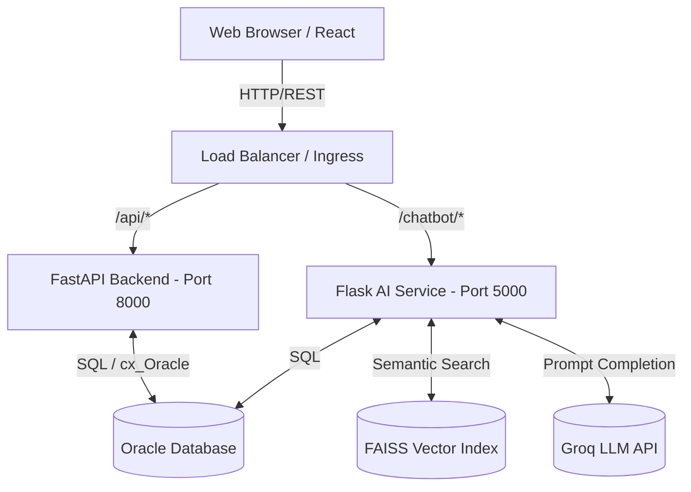

# Enterprise Architecture

This document describes the high-level system architecture and component interactions.

## High-Level System Architecture

## Component Breakdown

### 1. React Frontend
- State Management: `useState`, `useEffect`
- Routing: `react-router-dom`
- Styling: Custom CSS (`index.css`), glassmorphism and Lucide-React icons.
- Networking: Axios instance (`api.js`) passing JWT in the Authorization header.

### 2. FastAPI Core (Python)
- **Role**: Serves all business logic (Auth, Tasks, Admin, Documents).
- **Authentication**: Validates JWTs, issues new tokens, implements Dependency Injection (`Depends(require_role(...))`) to enforce RBAC.
- **Database Connection**: Uses Oracle DB connection pooling for high availability and robust transactional integrity.

### 3. Flask AI Service
- **Role**: Semantic RAG (Retrieval-Augmented Generation) Chatbot.
- **Embedding**: Uses `sentence-transformers` (`all-MiniLM-L6-v2`) to embed `ONBOARDING_FAQS` directly into a local, in-memory FAISS vector index during startup.
- **Context Injection**: Retrieves real-time pending tasks, active documents, and training statuses for the exact querying user from Oracle.
- **Generation**: Formats the matched FAQ + user context into a strict system prompt and queries the Groq Llama 3 API for natural language responses. Features a robust fallback mechanism if Groq fails.

### 4. Oracle Database
- Relational schema defining strict dependencies (Foreign Keys) between USERS, ASSETS, DOCUMENTS, and TASKS.
- Contains triggers and constraints to prevent orphaned data.

### 5. DevOps / Deployment
- **Docker**: Containerized microservices (Frontend, Backend, AI).
- **Kubernetes**: Uses declarative YAML for scaling (Deployments) and internal DNS resolution (Services).
- **Jenkins**: Declarative pipeline executing CI/CD validation.
