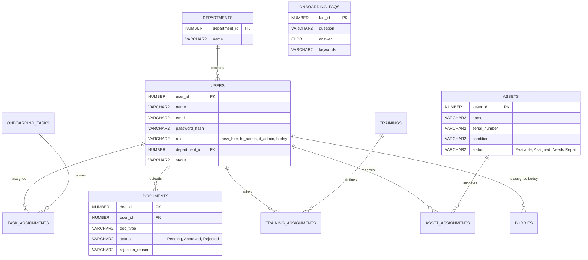

# Database Schema Reference

The portal relies on Oracle Express Edition (XE) with the following relational schema.

## Entity Relationship Diagram

## Audit Integrity
All assignment tables (`TASK_ASSIGNMENTS`, `DOCUMENTS`, `ASSET_ASSIGNMENTS`) record timestamps for creations and modifications. 
The database incorporates `ON DELETE CASCADE` triggers inherently managed by API logic to ensure data remains orphaned-free if a user or department is deleted.
